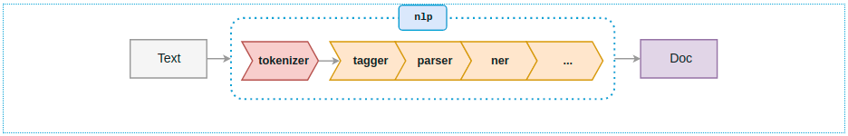

# library.qai.spacy

Customized SpaCy pipeline

## Installing

This is available on [PyPi](https://pypi.org/project/en-qai-sm/)

```sh
$ pip install en-qai-sm
> installs the package and deps including spacy
```

## Usage

```python
import spacy
nlp = spacy.load('en_qai_sm')
>>> doc = nlp("I ain't got no hands!")
>>> for token in doc: print(token, token.pos_)
...
I PRON
ain't VERB
got VERB
no DET
hands NOUN
! PUNCT
```

## About SpaCy pipelines

Default spaCy pipeline consists of 4 steps (components):



- `tokenizer` - splits text into tokens
- `tagger` - assigns part-of-speech tags
- `parser` - assigns dependency labels
- `ner` - detects and label named entities

Custom components (ex. any functions on `doc`) can be inserted into the pipeline (at any place after the `tokenizer`. For simplicity, `tokenizer` is not listed in pipelines descriptions.)

Reference: [spaCy docs](https://spacy.io/usage/processing-pipelines).

## Pipeline components

### v1.0.0

The pipeline consists of:

```python
pipeline = [
    "merge_matcher",
    "tagger",
    "parser",
    "ner"
    ]
```

where ```merge_matcher``` matches and merges into 1 token spans of type:

- connected by hyphens ex.  ```rock-hard```
- contractions ex. ```don't```
- special (informal) short forms ex. ```gonna```


## License

As this is just a small extension of spaCy's `en_core_web_sm`, we include the same license - MIT.
